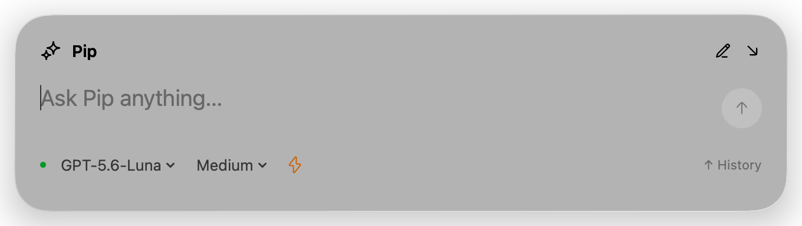

<div align="center">

# Pip

**Your Codex subscription, one shortcut away.**

A native macOS assistant that lives in your menu bar.



Swift · Liquid Glass · On-device dictation

</div>

## An assistant that stays close

Press **Command–Space**, type or speak, and let Pip get to work. Collapse it into the corner while a task runs, then bring it back to continue the conversation. Start something new whenever you want—previous work continues in the background.

- **Native Liquid Glass.** A floating prompt panel, a compact corner view, and a menu bar home. No Dock icon.
- **Your Codex models and tools.** Choose from the models available to your subscription, with app-wide reasoning and Fast mode preferences. Pip connects to your installed Codex CLI and inherits its configured tools and plugins.
- **Hold to talk.** Hold Command–Space or Right Option to dictate. Parakeet transcribes on your Mac; release to submit, or turn automatic submission off. Setup shows the model's download and preparation progress.
- **Conversations you can return to.** Browse history from the keyboard, resume an earlier thread, or send a follow-up while work is still running.
- **Quiet when the work is done.** An optional first-turn classifier can dismiss successful actions that need no further response. Answers, questions, and uncertain outcomes stay visible.

## Get started

Pip is an **early developer preview**. Download a date-versioned build from [GitHub Releases](https://github.com/dakdevs/pip/releases/latest), or build locally. Preview downloads are not yet Apple-notarized; macOS may require explicit approval on first launch.

You'll need:

- An Apple Silicon Mac running **macOS 26 or later**.
- The [Codex CLI](https://developers.openai.com/codex/cli) and a ChatGPT account with Codex access.

To build from source, you'll also need Xcode with a **Swift 6.2 or later** toolchain selected:

```sh
git clone https://github.com/dakdevs/pip.git
cd pip
./script/build_and_run.sh --verify
```

The script builds and launches `dist/Pip.app`. Guided setup connects Codex, checks sign-in, configures shortcuts, and prepares optional local dictation. Once built, you can open `dist/Pip.app` directly.

Command–Space is also Spotlight's default. Change Spotlight's shortcut in System Settings, or choose a different shortcut for Pip during setup.

Release builds check GitHub for signed updates automatically. Use **Check for Updates…** in the menu bar, or configure automatic checks and downloads in Settings. Updates wait for active work before restarting Pip.

## Keyboard controls

| Shortcut | Action |
| --- | --- |
| **⌘ Space** | Open or collapse the active conversation |
| **Hold ⌘ Space** | Open Pip and dictate; release to finish |
| **Hold Right Option** | Dictate while the prompt is focused |
| **⌘ N** | Start a new conversation; existing work continues |
| **⌘ ← / →** | Lower or raise reasoning effort |
| **⌘ F** | Toggle Fast mode |
| **↑** in an empty prompt | Browse conversation history |
| **Esc** while focused | Cancel recording, minimize running work, or end a completed conversation |

Clicking outside the panel collapses it. Shortcuts, voice behavior, model, reasoning, and Fast mode are configurable in Settings.

## How it works

Pip's interface is written in Swift with SwiftUI and AppKit. It communicates with `codex app-server` over JSON-RPC for authentication state, model discovery, streaming responses, tool requests, and conversation management.

Codex handles model requests and agent execution. Pip uses Codex's existing sign-in without copying credentials into the project. It keeps drafts and a local conversation cache under `~/Library/Application Support/Pip`; Codex owns the canonical transcript.

Dictation runs locally through [FluidAudio](https://github.com/FluidInference/FluidAudio) and Parakeet v3. The voice model downloads during setup and loads from its cache on later launches. The resulting prompt is sent to Codex when you submit it.

Computer-use availability depends on your Codex installation, enabled plugins, and macOS permissions. Pip presents supported access requests in the conversation; not every plugin or permission flow has been verified end to end.

## Development

```sh
# Build without launching
./script/build_and_run.sh --build

# Run protocol, state, and dictation checks
swift test

# Opt-in integration checks
PIP_TEST_CODEX=1 swift test --filter CodexIntegrationTests
PIP_TEST_PARAKEET=1 swift test --filter ParakeetIntegrationTests
```

The Codex integration checks use your subscription. The Parakeet check downloads model assets if needed and transcribes a public speech fixture without recording the microphone.

For implementation details, see the [interaction contract and architecture](docs/implementation.md), [dictation notes](docs/dictation.md), [icon sources](docs/icons.md), and [release/updater guide](docs/releases.md). Interface icons use selected [Hugeicons](https://hugeicons.com/) artwork; the supplied license notice is included with the assets.
